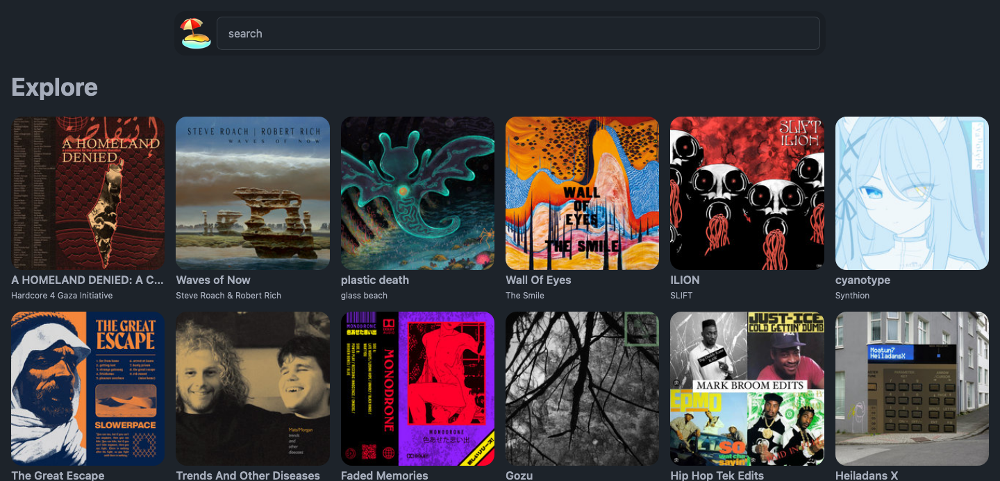
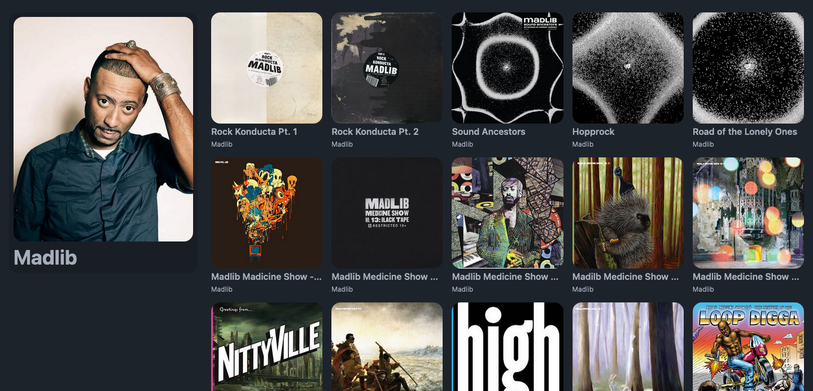
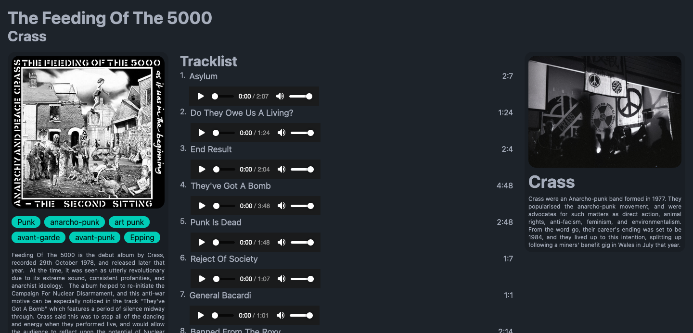

# sunburn

Sunburn is an alternative frontend (like Invidous, Nitter or Libreddit) for Bandcamp.

## Features

- search bands and albums
- play tracks from the built-in player
- serve images and audio through a proxy
- beautiful and easy to use ui
- no javascript required

## Screenshots

_Explore_

_Artist_

_Album_

## Developing

1. Clone the repo to your machine
2. Install dependencies with `bun install`
3. Run `bun dev --open` and all changes to the code will update the page in the browser

## Deploying

(todo)
